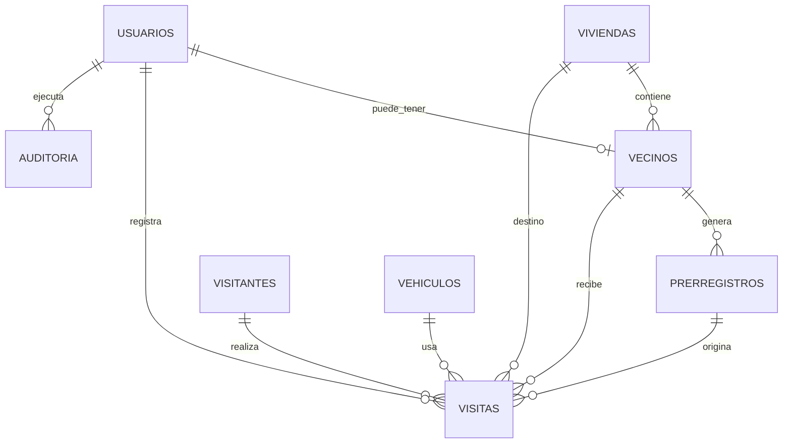

```mermaid
erDiagram
    USUARIOS ||--o| VECINOS : puede_tener
    VIVIENDAS ||--o{ VECINOS : contiene
    VECINOS ||--o{ PRERREGISTROS : genera
    VECINOS ||--o{ VISITAS : recibe
    VIVIENDAS ||--o{ VISITAS : destino
    VISITANTES ||--o{ VISITAS : realiza
    VEHICULOS ||--o{ VISITAS : usa
    PRERREGISTROS ||--o{ VISITAS : origina
    USUARIOS ||--o{ VISITAS : registra
    USUARIOS ||--o{ AUDITORIA : ejecuta
```
